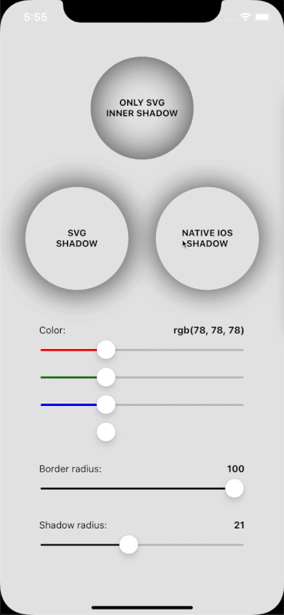
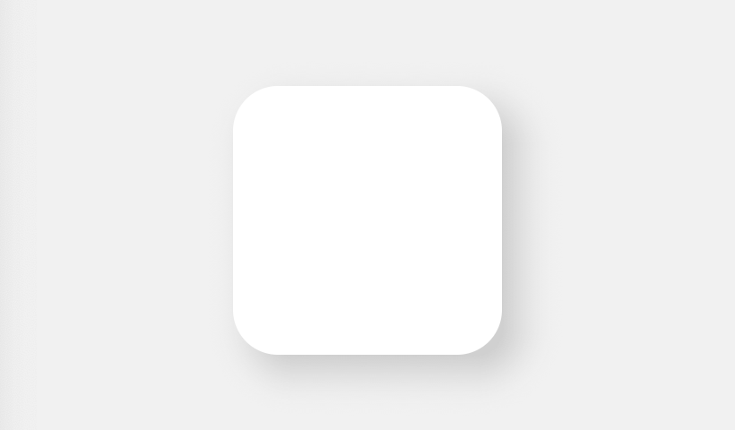
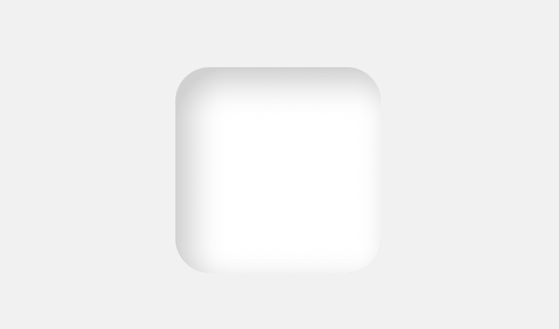
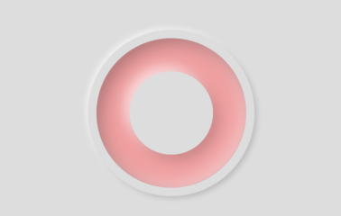

[](https://badge.fury.io/js/react-native-neomorph-shadows)

# react-native-neomorph-shadows
Neomorphism UI shadows for iOS &amp; Android, include SVG inner/outer shadow component powered with react-native-svg, which can provide shadow on Android identical like iOS.

<p align="center">
  
  
</p>

## Installation
***
### Step 1
Run the command below to install the plugin.
```
npm i react-native-neomorph-shadows
``` 

### Step 2
Install SVG library if not installed in your project [`react-native-svg`](https://github.com/react-native-community/react-native-svg):
```
npm i react-native-svg
```
Great! Let's start to use it.

## Usage
***
There are two components: ShadowBox & NeomorphBox 
Prop style supports most of the view styles.

<b>IMPORTANT: ShadowBox & NeomorphBox dont't support `Flex`.</b>
### ShadowBox

SVG Shadow works and style props identical like iOS shadow UI

<p align="center">
  
  
</p>

```
import { ShadowBox } from 'react-native-neomorph-shadows';

...

<ShadowBox
  inner // <- enable inner shadow
  useSvg // <- set this prop to use svg on ios
  style={{
    shadowOffset: {width: 10, height: 10}
    shadowOpacity: 1,
    shadowColor: "grey",
    shadowRadius: 10,
    borderRadius: 20,
    backgroundColor: 'white',
    width: 100,
    height: 100,
  }}
>
  ...
</ShadowBox>
```

### NeomorphBox

Opacity of two shadows automaticly changing and depends of `backgrounColor` brightness.

<p align="center">
  
  
</p>

```
import { NeomorphBox } from 'react-native-neomorph-shadows';

...

<NeomorphBox
  inner // <- enable shadow inside of neomorph
  swapShadowLevel // <- change zIndex of each shadow color
  style={{
    shadowRadius: 10,
    borderRadius: 25,
    backgroundColor: '#DDDDDD',
    width: 150,
    height: 150,
  }}
>
  ...
</NeomorphBox>
```

### Nested NeomorphBox

<p align="center">
  
</p>

```
<NeomorphBox
  style={{
    shadowRadius: 3,
    borderRadius: 100,
    backgroundColor: '#DDDDDD',
    width: 200,
    height: 200,
    justifyContent: 'center',
    alignItems: 'center',
  }}
>
  <NeomorphBox 
    inner
    style={{
      shadowRadius: 7,
      borderRadius: 90,
      backgroundColor: '#F19F9F',
      width: 180,
      height: 180,
      justifyContent: 'center',
      alignItems: 'center'
    }}
  >
    <NeomorphBox 
      style={{
        shadowRadius: 7,
        borderRadius: 50,
        backgroundColor: '#DDDDDD',
        width: 100,
        height: 100,
      }}
    />
  </NeomorphBox>
</NeomorphBox>
```

## Props
***
### ShadowBox props

| Prop | Required | Type | Default | Description | 
| ---- | -------- | ---- | ------- | ----------- |
| style | false | object | {<br>shadowColor: 'black',<br>shadowOffset: {width: 0, height: 0},<br> shadowOpacity: 0,<br>shadowRadius: 0,<br>backgroundColor: 'white'<br>} | Like View`s style prop with a few difference. **Flex** not available. **width** & **height** is required. |  | 
| useSvg | false | bool | false | If **true**, the component will use svg shadow on both platform (iOS, Android)|
| inner | false | bool | false | If **true**, a shadow will be inside of component |
| children | false | node | undefined |  |

### NeomorphBox props

| Prop | Required | Type | Default | Description | 
| ---- | -------- | ---- | ------- | ----------- |
| style | false | object | {<br>shadowColor: 'black',<br>shadowOffset: {width: 0, height: 0},<br> shadowOpacity: 0,<br>shadowRadius: 0,<br>backgroundColor: 'white'<br>} | Like View`s style prop with a few difference. **Flex** not available. **width**, **height** & **backgroundColor** is required. |  | 
| swapShadowLevel | false | bool | false | If **true**, the value of `zIndex` property both shadows will swap|
| inner | false | bool | false | If **true**, shadows will be inside of component |
| children | false | node | undefined |  |
